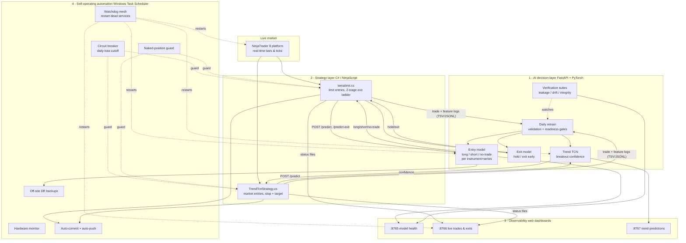

# Architecture

The system is four cooperating layers. The **AI decision layer** is the core; everything else exists to feed it clean data, act on its output safely, and keep it running.

## Data flow, end to end

1. **NinjaTrader** streams live bars/ticks to the two C# strategies.
2. A strategy detects a *candidate* setup (a chart-pattern crossover for `temalimit`; a multi-filter breakout for `TrendTcnStrategy`) and `POST`s the feature vector to its model service over localhost HTTP.
3. The **entry model** answers long / short / no-trade — but only if it has cleared its base-rate + directional gate; otherwise the strategy falls back to a plain rule-based signal.
4. If a position opens, `temalimit` polls the **exit model** on open trades to decide hold vs. exit early; `TrendTcnStrategy` re-checks its own **trend TCN** confidence every few bars.
5. Every setup, fill, and exit is written to **trade/feature logs** (TSV/JSONL) on disk.
6. Once a day, the **training pipeline** reads those logs, runs the **verification suites** to reject poisoned data, retrains per-instrument models behind readiness gates, and hot-loads the survivors.
7. **Dashboards** read the same status/log files to show model health, live trades with exit reasons, and trend predictions.
8. The **automation layer** independently watches every process and restarts, guards, backs up, and alerts as needed.

## Why these boundaries

- **Models run out-of-process from the strategy.** NinjaScript is single-threaded on the chart; a slow PyTorch forward pass can't be allowed to stall order handling. HTTP to a local FastAPI service keeps inference off the trading thread, and a model-service outage degrades gracefully to rule-based trading instead of halting.
- **Entry and exit are different models.** "Should I get in?" and "should I stay in?" have different features, different base rates, and different failure costs. Coupling them would let a good entry model paper over a bad exit policy.
- **Per-instrument, per-series models.** The same indicator value carries different information on different contracts and bar types; one global model would average away the edge and leak signal across instruments.
- **Verification is a first-class service, not a script.** In a system that trains on its own trade history, the fastest way to lose money is to train on subtly corrupt data. The checks that catch that run continuously and are surfaced on the model-health dashboard.

## Ports

| Port | Service | Role |
|------|---------|------|
| 8765 | `MLService` | Entry + exit models, model-health dashboard, verification, retraining |
| 8766 | `LiveDashboardServer` | Live trades, exit reasons, auto-applied sizing |
| 8767 | `MLService_Trend` | Trend TCN predictions + its own dashboard |
