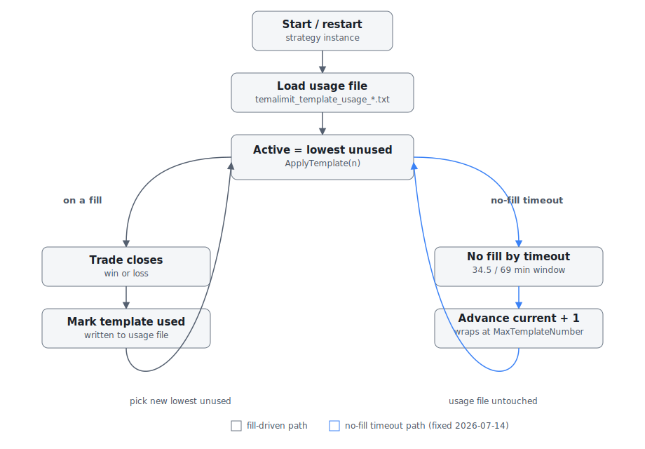
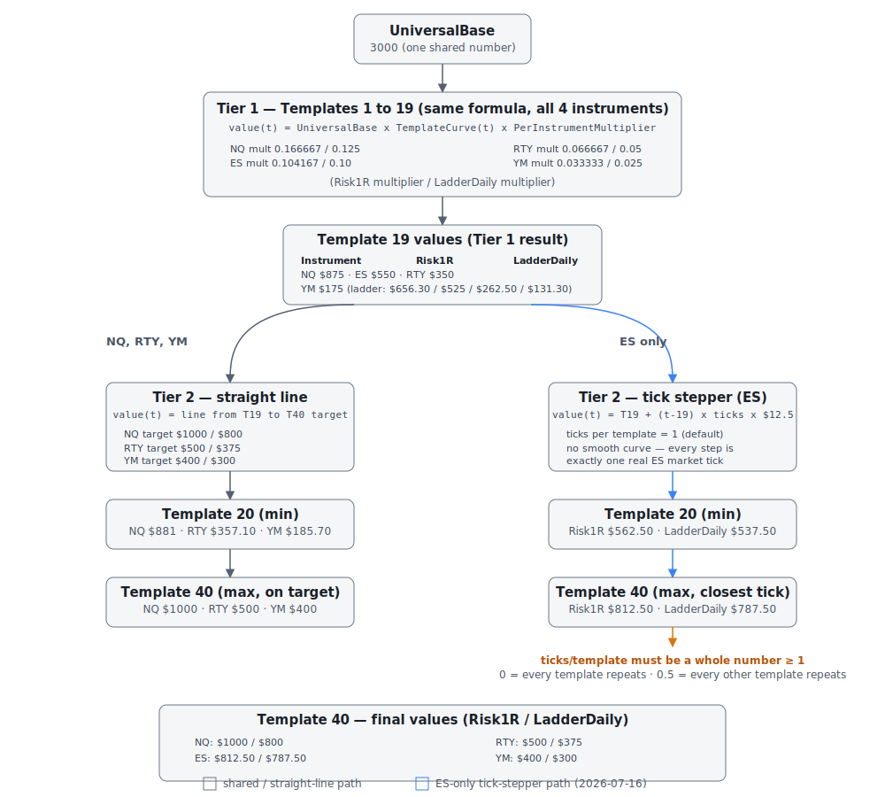
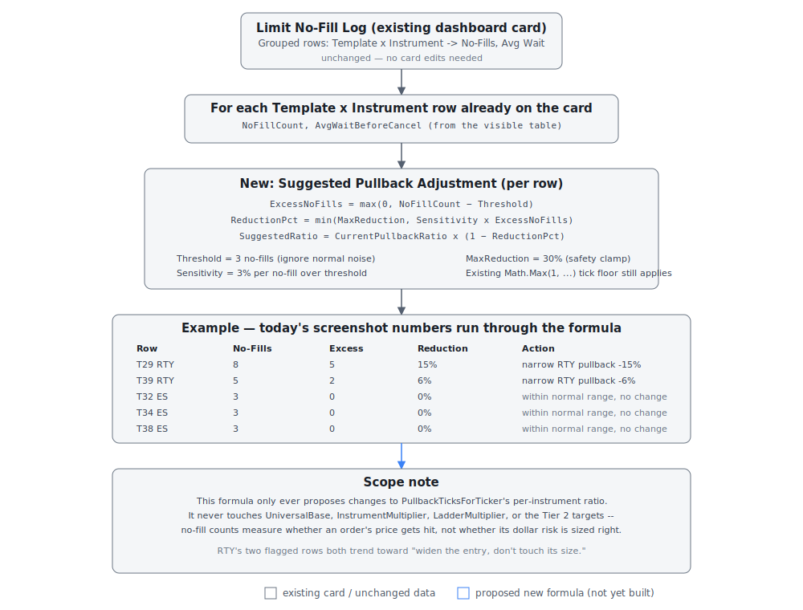
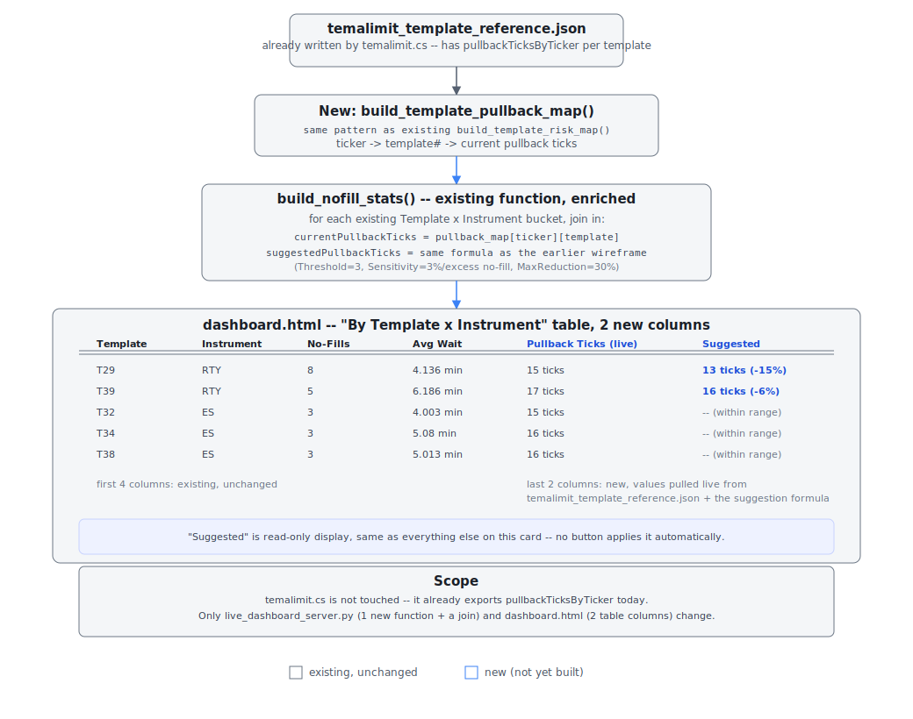

# Changelog

Plain-English changelog for the `temalimit` strategy (and other NT8 trading code). This used to live in the `soy` repo's README; it now lives here so `park` is the single home for changelogs and wireframes/diagrams across all NT8 projects.

See [wireframes/](wireframes/) for the related diagrams (referenced inline below).

---

                ┌──────────────────────────────┐
                │      ACTIVE TEMPLATE: T       │
                │          T = 1...40           │
                └──────────────┬───────────────┘
                               │
                               ▼
            Is this template marked as a winner?
                    │                      │
                  YES                      NO
                    │                      │
                    ▼                      ▼
           69-minute fill window    34m30s fill window
                    │                      │
                    └──────────┬───────────┘
                               │
          ┌────────────────────┼────────────────────┐
          │                    │                    │
          ▼                    ▼                    ▼
      Entry fills          No fill by            Position is
      before deadline      deadline              still open
          │                    │                    │
          │                    │                    └─ Keep template;
          │                    │                       never rotate during
          │                    │                       an open position
          │                    ▼
          │             Advance one:
          │             T1 → T2 → ... → T40 → T1
          │             Arm normal 34m30s window
          │
          ▼
    Trade eventually closes
          │
    ┌─────┴──────┐
    │            │
    ▼            ▼
  WIN          LOSS
    │            │
    ▼            ▼
Stay on T     T2–T39 → T-1
Arm 69m       T1 → T1
window        T40 → T1
              Arm normal 34m30s window

## Template Mode 3 rotation logic

`temalimit` doesn't use one fixed set of rules all day. It has 40 different settings profiles ("templates"), numbered 1 (strictest, fewest trades) to 40 (loosest, most trades), and it rotates through them over time. The picture below shows the rotation logic:

In plain terms:
- Every time an order is placed, there's a countdown. If the profile that placed the order has won a trade before, it gets more time to fill (69 minutes); if not, it gets less (about 34 minutes).
- If the order fills in time, the strategy trades it out normally.
- If it doesn't fill in time, the strategy gives up on that profile and moves to the next one in line.
- Once a trade is open, the strategy never switches profiles until that trade is closed.
- After a **win**, it keeps using the same profile. After a **loss**, it steps back one profile (gets a little stricter), unless it was already on the strictest one, in which case it resets to profile 1.

---

### New: a separate laptop hardware monitor, to help decide if this machine really needs 128GB of RAM (July 19, 2026)

This one has nothing to do with the trading strategies or the AI -- it's a standalone background tool that watches the laptop itself (memory, CPU, GPU) to answer one question: can this workload run comfortably on 64GB of RAM instead of 128GB?

- Every 15 seconds it checks memory used, how hard Windows is leaning on the pagefile, CPU load, and GPU/video-memory use, and keeps a running log.
- It only sends a phone alert when something *changes in a lasting way* -- never for a brief spike. You'll hear from it when usage crosses into a risk zone for a few minutes straight, when it drops back down, or if CPU/GPU stays pegged for several minutes. Otherwise it stays silent.
- Each alert ends with a plain recommendation: "64GB likely safe," "64GB borderline," or "keep 128GB" -- based on how much memory is actually being used and how much pressure is on the pagefile, not guesswork.
- Phone alerts go through the same free notification service the trading alerts use, but on its own separate channel, so hardware alerts and trading alerts don't get mixed together.
- It starts automatically when the laptop is logged into and runs quietly in the background with no window, restarting itself if it ever has a problem -- same setup as the other background watchdogs already protecting this machine.

Nothing about trading logic, data, or the AI changed -- this is a separate, independent tool living alongside the trading system.

### Investigated the two red "drift" warnings -- verdict: the market changed, the data didn't break (July 19, 2026)

The new Models-page attention bar was flagging two failing data checks. Digging in showed both trace back to the same real-world event: July 16-17 were strongly falling, more volatile days, very different from the calmer July 5-15 stretch the AI's training data mostly comes from.

- **"Label distribution drift"**: recent practice trades suddenly skew heavily toward "short" -- because shorts genuinely kept winning on those two down days, across several markets at once. That's the market, not a bookkeeping bug. Two small markets were failing this check on barely a dozen recent samples, which is statistical noise -- the check now needs at least 40 recent samples before it's allowed to raise a red flag (it shows an amber note instead). The one legitimately large shift (NQ 60-Range, 416 recent samples) still shows red, honestly.
- **"Feature drift"**: mostly driven by two inputs that literally measure price level and volatility -- of course they move when the market trends. Those now get their own amber "level drift" note instead of a red flag. Interestingly, once they stopped hogging the report, it turned out the trend/volatility change also shifted several other inputs past the red line -- so this check stays honestly red for now: the AI really is seeing market conditions unlike most of its training history. Every check that would indicate actual data corruption still passes.

Both red flags should fade on their own as more post-July-16 data accumulates. If they're still red in a week, that's a real signal worth acting on. Only the checking logic changed -- no trading behavior, data, or models were touched.

Later the same day, the identical fix was applied to the trend robot's dashboard (port 8767): its oil-market label warning dropped from red to amber (it rested on just 17 recent samples), and its input-drift check now files the "how trendy/choppy is the market" gauges under an amber regime note -- it stays honestly red for now because a genuinely stationary input also shifted with the trend.

### The three dashboards got one shared look, and each one now has a clear job (July 18, 2026)

Until now the three dashboards looked like three different products, and the live-trading page was crowded with engineering panels that made visitors ask "what is this stuff?". They have been redesigned around one rule: **the live page is for anyone; the other pages are for engineers.**

- **Live (port 8766) is now the splash page.** One big profit/loss number with the equity chart and time-range buttons right under it, the open/pending/completed trade lists, and a single "Breakdown" card with tabs (by market, direction, session, exit reason). Anything jargon-heavy moved out. A small "Models" chip in the header answers "are the robots healthy?" with a green dot and links to the details.
- **A new "Ops" page (port 8765/ops) is the engineers' room.** All six auto-tuning evidence panels that used to crowd the live page (Reassess Activity, Template Coverage & Usage, No-Fill Log, ATR Pullback, Sizing Reassess, Entry Gate Reassess) live there now, unchanged, fed live from the same data.
- **Models (port 8765) leads with the verdict.** A header chip shows how many integrity checks pass, and a red "Attention" bar appears only when something is actually failing -- no more reading sixteen sections to find the one problem. The five sample-distribution tables merged into one tabbed "Data Mix" card.
- **Trend (port 8767) is card-first.** Each market gets a card showing its status, progress toward the 100-sample training gate, and accuracy once trained; the giant 14-column table is still there, one click away. The four "Recent ..." tables merged into one "Activity" feed with tabs.
- **One visual language everywhere:** flat dark panels, no neon gradients or glow, red and green reserved strictly for losses/wins and failures/passes, no emoji. Every page links to the other three from its header, and the restart/retrain buttons moved into a tidy "..." menu so they cannot be clicked by accident.
- **Phones work now.** The Models and Trend pages had no phone layout at all (tables scrolled sideways inside cards); every table now folds into neat label/value rows on a small screen, and the live page gets a thumb-reach tab bar at the bottom. Card dragging on the live page is behind an explicit "Edit layout" button, so browsing cannot accidentally rearrange things.

Nothing about trading logic, data collection, or the AI changed -- this is purely how the information is presented.

### Fixed: practice-trade data was occasionally filed under the wrong market, and the AI's report card was too easy to ace (July 18, 2026)

Two data-honesty problems in `temalimit`'s AI (the port-8765 server), found by auditing every practice trade it has ever recorded:

1. **A few hundred practice trades were filed under the wrong market.** The strategy watches four markets (Nasdaq, S&P, Dow, Russell) inside one program, switching between them many times a second. A now-fixed bookkeeping gap meant a practice trade could be *opened* while watching one market but *recorded* while watching another — so, for example, Nasdaq market data got saved into the S&P's study pile. Two waves of this were found (July 9–10 and July 15–16, about 420 records total); all were removed, with backups kept, and the affected AI models were retrained on the cleaned data. Two tripwires now make a repeat impossible to miss: each practice trade remembers which market opened it and refuses to be recorded under any other, and a new dashboard check ("Cross-instrument bleed") scans the whole pile for wrong-market records on demand.
2. **The AI's report card was too easy to ace.** A model earns real trading power (the right to veto the strategy's entries) by scoring well on recent data it wasn't trained on. But when that recent data is mostly "don't trade" moments, a lazy model that *always* says "don't trade" scores near-perfect — and one such model had quietly earned veto power and blocked over 12,000 potential S&P entries in three days. The grading now requires beating the "always say don't-trade" score by a real margin, on a test that includes enough genuine buy/sell moments to be meaningful. Result: today, zero models hold veto power — every market trades on the strategy's plain technical signals until a model honestly earns it. A new "Base-rate gate" dashboard check fails loudly if an undeserving model ever slips through again.

Also: duplicate practice-trade records (the same moment saved once per settings profile) no longer inflate the AI's study pile — each unique market moment now counts once per outcome.

### New: a "Verification Suite" panel that automatically checks the entry-AI's training data and logic for problems (July 18, 2026)

Added a permanent dashboard panel (on both AI servers, ports 8765 and 8767) with a row of on-demand checks: things like "does the AI collapse to random guessing when we scramble the answers on purpose" (it should — if it doesn't, something's leaking), "does shuffling the training order change the result" (it shouldn't), "are there duplicate practice trades bleeding from the practice pile into the exam pile," and "is the AI's report-card grading itself honestly." Each check shows Pass/Warning/Fail with details, and results are saved so they survive a restart. This is what caught the wrong-market bookkeeping bug and the too-easy report card described above — it's now a standing checkup, not a one-time investigation.

### Fixed: the exit-AI had never learned anything, ever, because of one flipped condition from day one (July 18, 2026)

The strategy has a second, separate AI meant to help decide *when to get out* of a trade, not just when to get in. Every closed trade should teach it two things: what a "still holding" moment looks like, and what an "exit" moment looks like. An audit found it had logged over 185,000 "still holding" examples and exactly zero "exit" examples — ever — so its lesson plan was always incomplete and it could never graduate to trading with real influence. The cause: a piece of code meant to fire the instant a trade closed was checking the wrong flag — one that, due to how NinjaTrader reports trade executions, could never actually come out true. It's been checking a broken condition since the exit-AI feature was first built. Fixed to check the right thing; exit examples now start accumulating on the next closed trade for each market. (Left deliberately untouched: a related, currently-inactive feature where the strategy would also switch settings profiles the moment a trade closes — turning that on is a separate decision for later, since it's never run live before and no-fill timeouts currently do that job.)

### Fixed: a bookkeeping bug meant the exit-AI's "is it ready for more responsibility" checklist could never be graded correctly (July 18, 2026)

Related to the fix above. The strategy checks daily whether the exit-AI has proven itself enough to earn more control, but the check it was sending to the AI server was missing a piece of information (which specific chart type/series it meant), so the server always graded a nonexistent, empty placeholder instead of the real one — meaning the answer was always "not ready yet," regardless of how well-trained the AI actually was. In practice this was mostly hidden by a second, correctly-wired check running elsewhere that happened to keep things working — but the primary checklist itself was broken and is now fixed.

### Fixed: if the entry-AI's server went offline or hiccupped, the strategy stopped placing entries entirely instead of just trading without AI input (July 18, 2026)

Previously, if the strategy couldn't reach its AI helper (server down, network hiccup, bad response), it gave up on that entry signal completely rather than falling back to trading on its own plain technical rules — the same safe fallback it already uses when the AI is technically online but not confident enough to trust. Now an AI outage behaves the same safe way: trade on the plain signal instead of going silent. Given a recent AI-server hiccup earlier this session, this was a real risk, not a hypothetical one — an AI outage could have quietly halted every AI-enabled market with no obvious symptom other than "nothing is happening."

### The automatic settings-editor got two stuck-forever bugs fixed, and gained a dashboard view of exactly what it decided today (July 18, 2026)

The background process that reads real trading evidence and tweaks a handful of settings automatically (introduced July 17) had two more variations of the "propose the same change and reject it forever" bug pattern from that original release:

1. For one contract, the suggested per-trade risk amount for the highest-tier profiles was mathematically impossible to reach without breaking a safety rule (amounts must always increase as profiles get looser) — so it kept proposing the same doomed change and rejecting it, five minutes at a time, forever. It now instead moves partway toward the suggestion, as far as it safely can, and clearly labels the rest as "needs more real evidence on the lower profiles first."
2. Two other settings (how much extra time to give a slow-filling order, and how far to widen the entry filters) could get permanently pinned at their maximum allowed value, but the automation kept "suggesting" that same maximum value forever and immediately rejecting it as a no-op, showing a misleading "ready to apply" flag on the dashboard the whole time. It now recognizes "already at the ceiling" as a distinct, calm state instead of a stuck suggestion.

Also: the skip/reject log (which had ballooned to ~2,190 lines from a handful of stuck findings repeating every 5 minutes) now only logs each distinct finding once per day instead of every single check cycle, and the previously-misleading skip messages ("just rounding noise") now correctly distinguish "this is already applied" from "this is genuinely below the threshold to act on."

**New: Reassess Activity card.** The dashboard now has a card showing, day by day, exactly what the automatic settings-editor found and decided — with filter buttons (All / Applied / Rejected / Skipped / Dry-run) so the rare real change doesn't get lost in a sea of routine no-ops, and the one change that actually got applied today always sorts to the top.

### Practice-trade record-keeping cleanup: fixed a handful of bookkeeping gaps in how the AI's "pretend trades" are simulated and logged (July 18, 2026)

The strategy constantly paper-trades all 40 settings profiles in the background (not real money — just watching "would this profile have won or lost right now") to keep feeding the AI fresh examples. An audit of that simulation and its logging found and fixed several small-but-compounding gaps:

- The pretend trades were placing their entry order at a distance from price that no longer matched what real trades actually use (a leftover from before the entry-cushion formula was tuned per contract) — so the practice trades' win/loss outcomes described a different, easier-to-fill strategy than the one really trading. Now they use the exact same distance calculation real trades do.
- A background export process was quietly overwriting the same "most recent entry distance" snapshot that real trades and the dashboard both rely on, so occasionally the wrong distance got shown or logged for a trade. Split into a read-only calculation and a separate write-only one so they can't step on each other.
- A timing value used to match up a practice trade with its result could occasionally get assigned inconsistently within the same instant when multiple markets update back-to-back, which could misfile which AI example belongs with which outcome. Fixed to stay consistent.
- A "how long did this order sit unfilled" measurement was getting cut short every time a different order expired nearby, systematically undercounting genuine long waits. Fixed to measure the real elapsed time.
- A "how close did this order come to filling" measurement could occasionally look at price data from slightly before the order even existed, making some near-misses look like closer calls than they really were. Fixed to only look at price action after the order was placed.

None of these were dramatic on their own, but they all fed the same automatic settings-editor described above, so cleaning them up makes its suggestions more trustworthy going forward.

### The entry-price cushion for the loosest settings profiles turned out to have shrunk to almost nothing by accident — restored to its intended size (July 18, 2026)

For the loosest dozen or so profiles on each contract, the required pullback distance before placing an entry had — through a chain of small automatic adjustments — drifted down to essentially "fill immediately, no cushion at all." Comparing real trades from before and after that drift happened: the tiny-cushion trades filled far more often, but lost money on 3 of the 4 contracts, while the wider-cushion trades made money on all 4. More fills of worse trades. Restored the intended cushion sizes, and added a safeguard so the automatic adjuster can't be fed the same stale "it kept missing by a little" evidence that caused the drift in the first place and walk it back down again.

### New dashboard view: see exactly which settings profile every running copy of the strategy is using right now (July 18, 2026)

Previously the only way to check which profile a given chart was actively trading was to open that specific chart's Output log. Added a live table to the AI dashboard listing every running instance (account, contract, chart type) and its current profile, refreshed automatically.

### Two new rotation styles: "Losers First" and "Winners First" — plus a timing fix for switching between overnight and day-session profile ranges (July 18, 2026)

Two new rotation modes, selectable alongside the existing ones: "Losers First" trades only the profiles that are currently losing money overall, starting with the biggest loser and working through them in order (on the idea that a losing profile deserves another look before a winning one is touched) — "Winners First" does the mirror image, starting with the biggest winner. Both re-rank continuously off real running profit/loss per profile, and a profile that flips from losing to winning (or vice versa) automatically drops out of the mode it no longer belongs to.

Also fixed a smaller, related timing bug: when the "only trade certain profiles overnight vs. during the day" setting is on, crossing that overnight/day boundary didn't always immediately snap the strategy back into the newly-allowed range — it could keep trading a now-disallowed profile for up to the length of one full no-fill waiting window (roughly 10–23 minutes) before self-correcting. Now it corrects the instant the session boundary is crossed.

### Behind the scenes: closed two backup/monitoring gaps, added a local rollback safety net for the two live strategy files, and fixed a same-day dashboard glitch (July 17, 2026)

Routine hardening, not trading-behavior changes:

- **Strategy history now has an offsite backup.** The daily backup already copied plain snapshots of `temalimit.cs`/`TrendTcnStrategy.cs` to Mega, but never touched their actual version-control history — so if this machine's disk failed, the day-to-day rollback trail (see below) would have been lost even though a same-day file copy would have survived. The daily backup now also bundles the full git history into that day's backup folder.
- **New low-disk-space alert.** None of the four background watchdogs, nor the daily backup script, was checking free disk space — despite some log files growing continuously and unbounded (one is already 41MB and climbing). A silently full disk could have broken logging, training, or backups with zero warning. Now alerts to my phone if free space drops below 10 GB.
- **New local-only rollback safety net for the two live strategy files.** A background task now checks every 5 minutes whether `temalimit.cs` or `TrendTcnStrategy.cs` changed, and if so, saves a timestamped snapshot to local version-control history — so any past version can be restored if a change ever needs to be undone. This never uploads anywhere; it's purely a local "undo" trail, replacing an old script that used to also push to GitHub (which the strategy files never do — see the note at the bottom of this changelog).
- **Fixed a same-day dashboard glitch.** A dashboard change earlier the same day used a text-quoting style that looked fine in testing but broke in the browser after a restart, freezing two sections of the model-health page. Fixed, and the way these dashboard code changes get tested before shipping was upgraded to actually run the browser-side code through a real check instead of only checking the Python side.

### A safety-net tool now double-checks that per-market state never gets lost when the strategy juggles several charts at once (July 17, 2026)

`temalimit` runs multiple markets inside one strategy instance, and has to carefully swap ~150 pieces of per-market memory in and out as it switches between them. Missing even one piece on that swap silently loses that market's state without any error. Built a small checker that reads the code and confirms every one of those ~150 pieces is properly saved and restored — it immediately found one real (if low-impact) gap: two fields tracking the practice-trade rotation range weren't being saved, so a background cleanup step ran a full scan every single bar instead of only when it actually needed to. Fixed, and the checker now runs as a standing tool for future changes to this part of the code.

Separately, the practice-trade filters and the real-trade filters (three technical indicators' pass/fail logic) existed as separate, hand-duplicated copies of the same rules — a risky setup, since the practice trades are what teach the AI, and any drift between the two copies would mean the AI is training on subtly different rules than the ones actually trading. Consolidated them down to one shared core each, with the practice-trade and real-trade versions now just thin wrappers around the same logic, so they can no longer silently diverge. Verified with 200,000 randomized test cases that the before/after behavior is identical.

### Fixed: five real bugs in the trend-following robot (`TrendTcnStrategy`) and its AI server (July 17, 2026)

A full bug sweep of the trend robot and the AI program behind it (the one on port 8767), now that it's confirmed as actively trading (still in its learning phase — no trades taken yet). What was found and fixed:

1. **Its "change of heart" exit never worked — not even once.** The robot is supposed to re-ask its AI every 5 bars, "do you still like this open trade?", and bail out early if the AI's confidence has dropped. A subtle computer-math overflow in the "has it been 5 bars yet?" check made the answer permanently come out as "not yet," so the re-check never ran. Nobody noticed because the other exits (trend flip, stop-loss, profit target) still worked fine.
2. **All nine markets were feeding the AI crude oil's data for its most important input.** The function that reads buying-vs-selling pressure takes a "which market?" number, and it was accidentally hardcoded to market #0 — crude oil — for everyone. So the gold model, the Nasdaq model, the bitcoin model, and so on were all learning from crude oil's order flow while believing it was their own. Crude oil itself was unaffected (it really is market #0). Cleaned up the same day: threw out the 713 contaminated practice trades (out of 779 total — crude oil's own 66 were kept) and reset the two markets (the euro currency and the S&P 500) that had already finished training on the bad data back to "still learning," so nothing trades on a model built from someone else's numbers. Nothing was permanently deleted — the removed data and old models were moved to backup folders first.
3. **Four end-of-day settings did nothing.** The daily close-out time settings shown in the robot's options (including the special earlier close-out for the German DAX, whose broker margin rules end sooner) were never actually read by the code — close-out time came only from the exchange's session clock. Now the settings work: whichever close-out time comes first wins, and the DAX genuinely gets its earlier one.
4. **Asking the AI server to retrain one market secretly retrained all of them.** The retrain page even displayed the narrower scope it wasn't actually honoring. Now a one-market retrain really does touch only that market.
5. **The daily 2:05 PM self-retrain could corrupt answers given mid-retrain.** Retraining rebuilt the AI's brain in place while the robot might simultaneously be asking it for a prediction — briefly exposing a half-updated model. Retraining now happens on a private copy that's swapped in whole only when finished.

Also tidied up: the every-5-bars confidence polls (now that they actually run) are tagged so they don't clutter the dashboard's signals panel, a rare disk error can no longer permanently kill the daily retrain scheduler, and two comments claiming the trend AI lives on port 8766 (it's 8767) were corrected.

**New: the trend dashboard now watches itself.** A banner at the top of the trend dashboard replaces the manual "is everything actually working?" spot-check with two automatic warnings. First, if one market stops sending data while the others are still live, it's flagged — the closest the dashboard can get to noticing a strategy that's been switched off or has stopped compiling (the dashboard can't see inside NinjaTrader directly, so it watches for the market going quiet while its neighbors stay busy; when *everything's* quiet it just says "market likely closed" instead of crying wolf). Second, it actively watches for the exact kind of mix-up that caused the bug above — two markets showing the identical buying-pressure number, or one market's number frozen in place — and calls it out by name. When all's well it just shows a green "Healthy."

### Risk sizing now behaves differently after profile 19, so it can hit realistic per-contract limits (July 17, 2026)

**What it was:** The formula from the entry below used one smooth growth curve for all 40 profiles per contract. That's mathematically clean, but it meant I couldn't independently choose "how much should the riskiest profile (40) risk" without also changing every profile below it in a fixed ratio — and for the S&P 500 (ES) contract specifically, the formula's normal rounding (to the nearest quarter-point, $12.50) started producing two neighboring profiles with the identical dollar amount once the profile numbers got high enough.

**What it is now:** Profiles 1–19 keep using the original smooth formula. Profiles 20–40 switch to a second formula that's allowed to grow at a different rate, so I can set "what does profile 40 risk" independently of "what does profile 1 risk." For the S&P 500 specifically, profiles 20–40 grow by a fixed one-tick ($12.50) step per profile instead of a smooth curve — the only way to guarantee no two profiles ever land on the same dollar number given how coarse that contract's price increments are.

**Profile 1 → Profile 40, in dollars (per-trade risk / daily "keep trying" budget):**

| Contract | Profile 1 | Profile 40 |
| --- | --- | --- |
| Nasdaq (NQ) | $500 / $375 | $1,000 / $800 |
| S&P 500 (ES) | $312.50 / $300 | $812.50 / $787.50 |
| Russell 2000 (RTY) | $200 / $150 | $500 / $375 |
| Dow (YM) | $100 / $75 | $400 / $300 |

Verified by simulating all 40 profiles for all 4 contracts: no two profiles ever risk the identical dollar amount, the amount always increases with the profile number, the daily budget always stays below the per-trade risk, and Nasdaq always risks more than the S&P 500, which always risks more than the Russell, which always risks more than the Dow, at every single profile.

### Fixed: a file sync accident deleted a chunk of recent work, including an entire AI feature, without anyone noticing at first (July 17, 2026)

**What happened:** While reconciling two versions of the strategy file (one on this computer, one that had been uploaded through GitHub's website), the merge silently kept the older, uploaded version's code in two places instead of properly combining both sides. That wiped out the risk-formula rewrite above, and separately, it deleted the entire "AI can now pick the next settings profile" feature described further down — including the code that logs practice trades for that AI to learn from.

**How it was caught:** While investigating why some AI training data looked corrupted (see next entry), a search for the AI-template-selection code came up empty in the strategy file — even though NinjaTrader was still actively running it and still writing fresh training data. That only made sense if NinjaTrader was running an older, already-compiled version of the strategy that still had the feature, while the source file on disk had lost it. Comparing against an earlier saved version of the file confirmed it: the feature was gone from the file, but recoverable from an older save.

**The fix:** Restored the missing feature from the last version that had it, rebuilt carefully on top of the (also-since-changed) risk formula so nothing else broke, and double-checked nothing besides these two things was actually missing.

### Fixed: one data-quality bug, and hardened against future ones (July 17, 2026)

While reviewing the AI's practice-trade data, one real trade was logged as having moved over 22,000 points against the position — impossible for a contract that only trades in a roughly 700-point range total. The exact cause couldn't be pinned down for certain, but the fix doesn't require knowing the exact cause: the strategy now refuses to record any single-trade price swing bigger than a generous sanity limit, logging a warning instead so a repeat is actually visible rather than silently poisoning the data again.

### The No-Fill Log dashboard card can now suggest widening or narrowing the entry-price cushion, based on real measurements (July 17, 2026)

**What it was:** The dashboard already tracked orders that never filled (because price didn't pull back far enough to reach the order), but had no way to say by how much they missed, or whether the cushion should change.

**What it is now:** The strategy now measures, for every unfilled order, the closest the market actually got to the order's price before giving up. The dashboard uses that to suggest a smaller cushion for profiles/contracts that are consistently missing by a similar amount — and, in the other direction, a slightly bigger cushion for profiles that are filling every single time with room to spare (which might mean a better price was being left on the table). Suggestions only appear once there's enough real evidence (5+ measurements); thinner evidence just gets flagged as "keep watching."

### New dashboard card: Sizing Reassess (July 17, 2026)

Tracks, per contract and profile, how far real trades moved against the position before turning around (informs whether the per-trade risk amount has room to shrink or needs more room), and how much of a trade's peak profit actually got captured versus given back before it closed (informs the same question for the daily "keep trying" budget). Reversal trades — ones that built real profit and still closed at a loss — are shown as a plain dollar amount ("gave back $860 of $845 peak") rather than a percentage, since percentages built off a small profit peak can swing wildly and be misleading.

### The dashboard can now edit the strategy's own settings automatically — with a lot of guardrails (July 17, 2026)

**What it is:** A new background check, running every 5 minutes, reads the same evidence as the two cards above and — only when every profile that has enough real evidence for a given contract-and-setting agrees on the same direction — edits the strategy file to match. If even one qualifying profile disagrees, nothing happens; that setting just keeps collecting data.

**Guardrails:**
- Requires real, measured evidence (never a guess) for the "narrow the entry cushion" and "reduce per-trade risk" directions. The opposite directions (widen the cushion, raise the daily budget) are clearly labeled as an educated nudge rather than a measurement, since there's no direct way to measure "how much tighter could this safely be."
- Before writing anything, re-simulates the entire 40-profile curve for whatever's being changed and checks the same rules verified above still hold (no two profiles land on the same dollar amount, amounts always increase, Nasdaq > S&P 500 > Russell > Dow, and the daily budget always stays under the per-trade risk). If the change would break any of that, it's rejected and nothing is written.
- Saves a full backup of the strategy file before every single edit.
- Every check — whether anything changed or not — is written to a log file.

**Two real bugs already caught by watching it run for real, not just by reasoning about the design:**
1. One suggestion turned out to be built on a single real measurement, even though the underlying count looked like plenty of evidence — most of the other events it was "backed by" turned out to predate the measurement being logged at all. Fixed by counting only entries that actually have a real measurement.
2. Because the file only stores a couple of decimal places, one suggested value kept getting rounded down on write, which meant every 5-minute check saw a persistent (if tiny) mismatch and "corrected" it again — forever, without the file ever actually changing. Fixed by storing more decimal places.

---

### Risk-per-trade is now calculated by a formula, not a fixed price list (July 16, 2026)

**What it was:** Every combination of futures contract (Nasdaq/NQ, S&P 500/ES, Russell/RTY, Dow/YM) and settings profile (1–40) had its own hand-typed dollar amount in a price list — 160+ numbers to maintain by hand.

**What it is now:** One formula calculates the dollar risk for any contract and any profile automatically. The dollar amount still grows smoothly as the profile number goes up (profile 40 risks more than profile 1), and it's now guaranteed that **no two profiles ever risk the exact same dollar amount** — a problem the old price list occasionally had by accident (some neighboring profiles had accidentally landed on identical numbers).

**Amount risked per trade at Profile 1 (the strictest profile), in dollars:**

| Contract | Amount risked on a losing trade | Daily "keep trying" budget |
| --- | --- | --- |
| Nasdaq (NQ) | $500 | $375 |
| S&P 500 (ES) | $400 | $300 |
| Russell 2000 (RTY) | $200 | $150 |
| Dow (YM) | $100 | $75 |

The "daily keep trying budget" is always smaller than the per-trade risk amount, and both numbers grow together as the profile number goes up. Any contract the strategy doesn't recognize is treated the same as the S&P 500 (ES) row, just like before.

Nothing else about how the strategy enters or exits trades, talks to the AI service, rotates profiles, or logs data was touched — this change only affects how the dollar risk amount is calculated.

### AI can now pick the next settings profile instead of just cycling through them (July 15, 2026)

Added an optional switch (off by default) that lets the strategy ask its AI helper "which profile should I use next?" instead of always going in order. If the AI isn't confident yet (still learning, or hasn't seen enough trades), the strategy ignores it and falls back to the normal rotation — so turning this on is safe even before the AI is fully trained. With the switch off, the strategy behaves exactly as it did before this change.

### Phone alerts when an order is placed or filled (July 15, 2026)

The strategy now sends a notification to my phone the moment an order is placed and again when it fills — but only for my live trading account. Every other account (including the demo account) is ignored, so I don't get spammed by test trades.

### Fine-tuned how far price has to pull back before entering (July 15, 2026)

Adjusted how far the market needs to pull back before the strategy places an entry order. The required pullback distance is now different for each contract and gets bigger on looser (higher-numbered) profiles, so it doesn't chase price as aggressively when the settings are already loose.

### Fixed: orders kept getting cancelled forever near the overnight/day session switch, in "Custom Range" mode (July 15, 2026)

**The problem:** If I had picked a custom list of profiles to use (instead of the default full range) and the market crossed from overnight into regular trading hours (or back), the strategy thought the current profile was "not allowed right now" and cancelled every fresh order the instant it was placed — over and over, forever.

**The fix:** Custom Range mode no longer applies the overnight/day-session restriction that was never meant to apply to it in the first place.

### Fixed: strategy could get permanently stuck on one profile (July 14, 2026)

**The problem:** In "Unused Only" rotation mode, if an order never filled, the timeout logic always tried to jump to "the lowest-numbered profile I haven't traded yet" — but a profile only gets marked as "already traded" once a trade on it actually closes. So a profile that never filled kept picking itself again and again, forever, and the rotation would appear frozen.

**The fix:** When an order times out without filling, the strategy now just moves to the next profile in simple numeric order, the same way the basic rotation mode does. It only tries to prioritize "profiles I haven't used yet" after a trade actually closes.

### Fixed: another stuck-cancelling-orders bug at the overnight/day session switch (July 14, 2026)

**The problem:** When the market crossed from overnight into regular hours (or vice versa) and the current profile fell outside what was allowed in the new session, the strategy cancelled the order — but never updated which profile it thought it was on. So on the very next candle, it tried the same cancelled setup again, got cancelled again, and repeated indefinitely. (I confirmed this by checking the log file: over half of 279 logged "no fill" cancellations happened within the same minute the order was placed.)

**The fix:** When this cancellation happens, the strategy now also resets itself to a profile that's actually allowed in the new session, instead of getting stuck retrying the old one.

Separately, a related setting ("ignore session restrictions entirely" for the fully-random rotation mode) wasn't being respected correctly, and a record-keeping file that was supposed to track "which profiles have I already used today" turned out to have never actually been saved to disk — so the strategy always thought every profile was still unused. Both are now fixed.

### Documented ML template selection (July 15, 2026)

Documented how the AI template-selection switch works in the changelog (see entry above, "AI can now pick the next settings profile...").
